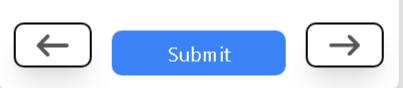
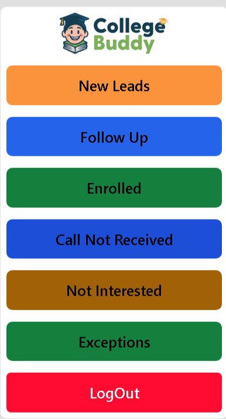
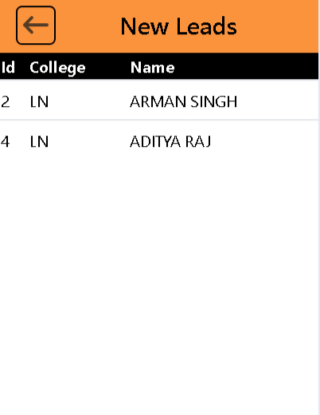

# Call Management System

## Introduction
The Call Management System is a comprehensive tool designed to help administrators efficiently allocate tasks to workers, manage student data, and track the progress of various tasks. This system aims to enhance productivity by streamlining the task assignment process.

## Features

### 1. Task Allocation to Workers
Admins can allocate tasks to different workers easily. This feature allows admins to assign tasks based on priority and availability, ensuring that tasks are managed efficiently.

### 2. Task Status Tracking
Monitor the status of tasks with categories like 'Pending', 'Fulfilled', and 'Not Interested'. This helps in keeping track of what tasks are completed, which are in progress, and which ones require follow-up.

### 3. Detailed Task View
View detailed information about each task by clicking on it from the task list. This view includes all relevant details and options to update task status or edit information.

### 4. Navigation through Tasks
Use 'Next' and 'Previous' buttons to navigate through tasks in a sequential manner. This makes it easy to review and update tasks without going back to the task list.

### 5. Student Data Management
Manage student data effectively, including adding new students, updating existing student information, and deleting student records. This feature is crucial for keeping track of student involvement in various tasks.

## Sections

1. **New Leads**  
   This section displays all the new student leads that have been added to the system. It helps admins and workers to easily identify and work on fresh leads.

2. **Follow Up**  
   The 'Follow Up' section contains students who require further contact or additional information. This ensures that no potential lead is left without attention.

3. **Enrolled**  
   This section lists all the students who have successfully enrolled. It helps keep track of the confirmed enrollments and manage their details effectively.

4. **Call Not Received**  
   In this section, you'll find students who could not be reached. It allows the team to keep track of those who missed the call and plan subsequent follow-up attempts.

5. **Not Interested**  
   This section contains students who have expressed no interest in the offerings. Keeping track of such leads helps in managing time and resources more efficiently.

6. **Exceptions**  
   The 'Exceptions' section lists cases that require special attention or do not fit into the standard categories. These may include unique situations or cases that need a different approach.

7. **LogOut**  
   The 'LogOut' button allows users to safely exit the system, ensuring that their session is ended and no unauthorized access occurs.

### Particular section list

The "Particular section " section provides a list of all newly added student leads. It helps admins and workers to quickly access and review information about potential students. Each entry in the list includes:

- **Id:** A unique identifier for each lead.
- **College:** The abbreviation or name of the college associated with the lead.
- **Name:** The full name of the student lead.

This section allows users to efficiently manage and prioritize follow-up actions for new leads, ensuring that all new inquiries are addressed promptly.

## Conclusion
The Call Management System is a robust solution for managing tasks and student data. It is designed to improve workflow efficiency and provide clear insights into task progress and management.

